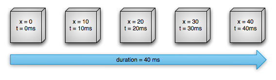
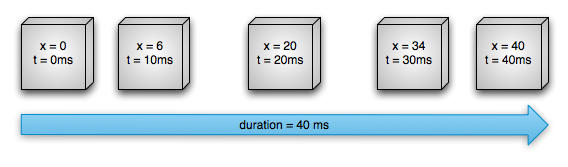

# Android Animation

The Android framework includes built-in animations for common effects and lets you create custom animation and transition lifecycle callback.

## Topics

* Property Animation
* Animate drawable graphics
* Reveal or hide a view using animation
* Move a view with Animation
* Move views using a fling animation
* Enlarge a view using a zoom animation
* Animate movement using spring physics
* Auto animate layout updates
* Animate layout changes using a transition
* Create custom transition animation
* Start an activity using an animation

- - -

# Property Animation

You can define an animation to change any object property over time, regardless of whether it draws to the screen or not.
A property animation changes a property's value over a specified length of time.

To animate something, you specify the object property that you want to animate, such as an object's position on the screen, how long you want to animate it for and what values you want to animate between.

> The property animation system lets you define the following properties of an animation:

* **Duration**: The duration of an animation. Default length is *300 ms*
  
* **Time interpolation**: You can specify how the values of the property are calculated as a function of the animation's current elapsed time.
  
* **Repeat count and behaviour**:You specify whether or not to have an animation repeat when it reaches the end of a duration and how many times to repeat.
  
* **Animator Set**: You can group animations into logical sets that play together.
  
* **Frame refresh delay**: How often to refresh frames of you animation.

> **Linear interpolation**: Object moves/animates at a constant speed

> **Non-linear interpolation**: Object animates with acceleration and deceleration

- - - 

## ValueAnimator

Object that keeps track of your animation's timing, such as how long the animation has been running, and the current value of the property that it is animating.

ValueAnimator provides a simple **timing engine** for running animations which calculate animated values and set them on target objects.

Value animator runs on **a custom handler** to ensure that property changes happen on the UI thread.

> By default, ValueAnimator uses *non-linear interpolation*, via the 
> **AccelerationDecelerationInterpolator** class, which accelerates into and decelerates out 
> of animation.

> This behaviour can be changed by calling **ValueAnimator#setInterpolation
> (TimeInterpolation)

## TimeInterpolator

A time interpolator defines the rate of change of an animation. This allows animations to have non-linear motion such as acceleration and deceleration.

* AccelerateDecelerateInterpolator
An interpolation where the rate of change starts and ends slowly but accelerates through the middle.
  
* AccelerateInterpolator
An interpolation where the rate of change start out slowly and then accelerates.
  
* AnticipateInterpolator
An interpolation where the change starts backward then flings forward.
  
* AnticipateOvershootInterpolator
An interpolation where the change starts backward then flings forward and overshoots the target value and finally goes back to the final value.
  
* BaseInterpolator 
An abstract class which is extended by default interpolators.
  
* BounceInterpolator 
An interpolation where the changes bounces at the end.
  
* CycleInterpolator 
Repeats the animation for a specified number of cycles.
  
* DecelerateInterpolator
An interpolator where the change starts out quickly and then decelerates.
  
* Interpolator 
Defines the rate of change. *Root*
  
* LinearInterpolator 
An interpolation where the rates of change is constant.
  
* OvershootInterpolator 
An interpolation where the change flings forward and then overshoots the lsat value then comes back.
  
* PathInterpolator
An interpolation that can traverse a Path that extends from **Point(0,0) to (1,1)**.
  

## Type Evaluator

Evaluators allows developers to create animations on arbitrary property types, by allowing them to supply custom evaluators for types that are not automatically understood and used by the animation system.

> When you call ***Start* on a ValueAnimator, the animation begins.

