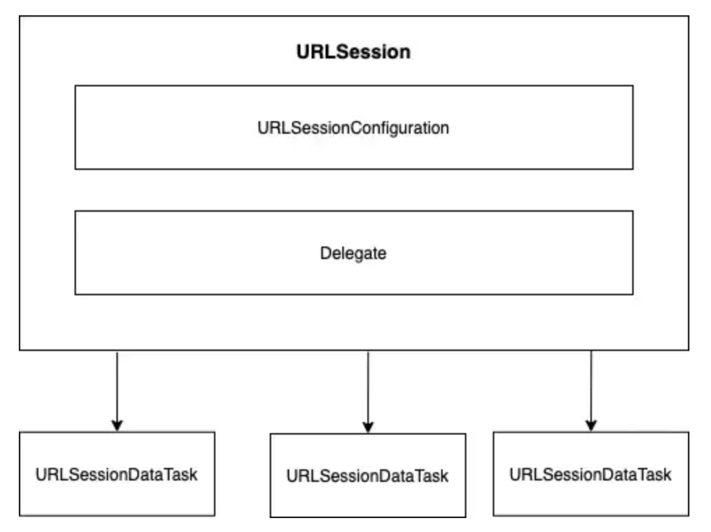

# IOS Networking

## Core APIs
* **URLSession**
* **URLSessionDataTask**
* **URLSessionDownloadTask**
* **URLSession.shared**
* **URLSessionConfiguration**
* **URLSessionDelegate**
* **URLSessionTask**
* **URLSessionTask.resume**
* **URLSessionTaskDelegate**
* **URLSessionTaskDelegate.dataTaskWith(:completionHandler)**

- - -

## URLSession

An object that coordinates a group of related network data transfer tasks.

```swift
class URLSession : NSObject
```

The URLSession class provides APIs for downloading data from and uploading data to endpoints indicated by URLs.

You can use related APIs such as **URLSessionDelegate** and **URLSessionTaskDelegate** to perform **Authentication** and receive events like **redirection** and task completion.

## URL Loading System

URL data loading is performed asynchronously.

Use a **URLSession instance** to create one or more **URLSessionTask instances** which can fetch and return data to your app.

To configure a session use a **URLSessionConfiguration object**

You can use one **URLSession repeatedly to create multiple tasks**


## Types of URLSessions

The URLSession API defines four types of tasks:

* **URLSessionDataTask**: Sends and receive data using **NSData objects**. **GET**
* **URLSessionUploadTask**: Similar to data tasks but they also send data and support background uploads while the app isn't running. **POST or PUT**
* **URLSessionDownloadTask**: Retrieve data in the form of a file and support background uploads and downloads. **FILES**
* **WebSocket Tasks**: Exchange objects over **TCP** and **TLS** using the **WebSocket Protocol**

## Using a Session Delegate

Tasks in a URLSession also share a common delegate object. You implement this delegate to obtain and share information when various events occur such as when:

* **Authentication fails**
* **Data arrives from the server**
* **Data becomes available for caching**

If you don't need the features provided by a delegate, you can use URLSession without providing one by just passing nil.

## Asynchronicity and URL Sessions

Like most networking APIs the URLSession API is highly asynchronous 

## URLSession Dependencies



URLSession has a dependency called **URLSessionConfiguration**, this is used to cofigure the http request properties such as **chaching policy, session type, https headers and timeout**

When you define a http session, you have three choices:

* **.default**: Will create a session configuration object that uses disk persisted global cache, credentials and cookie storage objects.

* **.ephemeral**: Similar to .default except the session configurationd data is saved in memory.

* **.background**: Creates a background session for upload and download tasks, it can be resumed or cancelled and can continue the task after the app has been terminated or killed

## URLRequest

URLRequest only represents information about the request.

A URLRequest encapsulates two essential properties of a load request:

* **The URL to load**
* **The policies used to load it**

For **HTTP** and **HTTPS** methods URLRequest constains the **HTTP methods (GET,PUT,POST and so on)** and the **HTTP Headers**

## URLSessionDataTask

A URL Session tasks that returns data directly to the app in memory

A data tasks returns data directly to the app in memory as one or more **NSData object**

- - -

## URLResponse

The metadata associated with a response to a URL load request, independent of protocol and URL scheme
