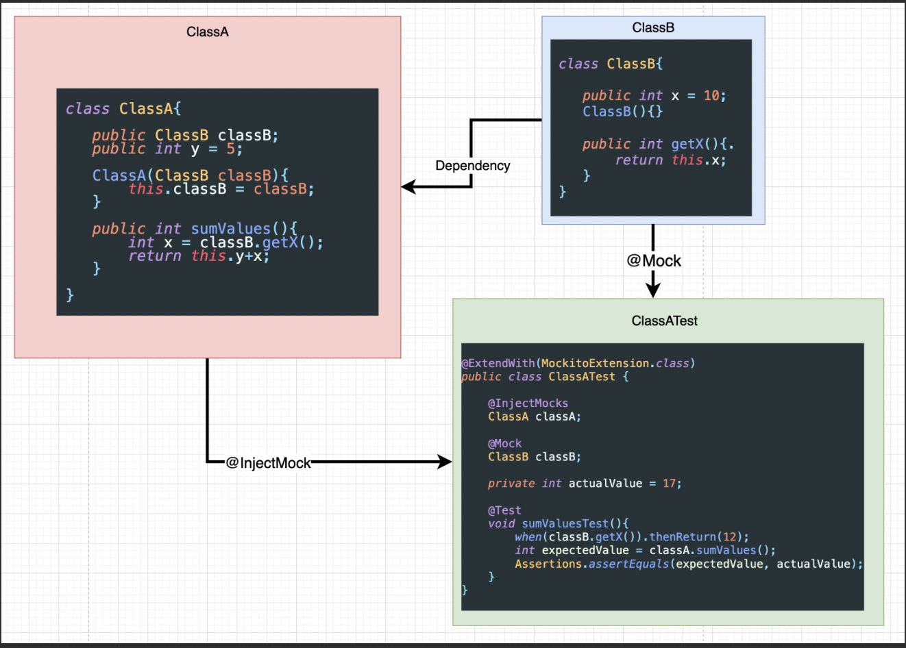

# Mockito

## Mockito-core vs Mockito-all

Mockito-core *only contains the mockito* classes but **mockito-all** contains mockito classes as well as other dependencies: namely **hamcrest & objenesis**.


> **mockito-all** is discontinued in mockito-2

## Objenesis:

Objenesis is a small java library that instantiates a class.

Java already supports dynamic instantiation with **Class.newInstance()**, however this only happens if the class a constructor with very particular characteristics. newInstance() cannot be used if:

* **Constructor requires arguments**
* **Constructor has side effects**
* **Constructors that throw exceptions**

Objenesis addresses this problem by bypassing the constructor on **object instantiation**.

There are particular use cases where this capability is useful:

* **Serialization, Remoting, Persistence**
* **Proxies, AOP (Aspect Oriented Programming) libaries and Mock Objects**
* **Container frameworks e.g Spring IoC**

## ObjectInstantiator

```java
interface ObjectInstantiator {
  Object newInstance();
}
```

## InstantiatorStrategy

```java
interface InstantiatorStrategy {
  ObjectInstantiator newInstantiatorOf(Class type);
}
```

The simplest way to use Objenesis is by using ObjenesisStd (Standard) and ObjenesisSerializer (Serializable compliant).

```java
Objenesis objenesis = new ObjenesisStd(); // or ObjenesisSerializer
```

Once you have the Objenesis implementation, you can then create an ObjectInstantiator, for a specific type.

```java
ObjectInstantiator thingyInstantiator = objenesis
                                                .getInstantiatorOf(MyThingy.class);
```

Finally, you can use this to instantiate new instances of this type.

```java
MyThingy thingy1 = (MyThingy)thingyInstantiator.newInstance();
MyThingy thingy2 = (MyThingy)thingyInstantiator.newInstance();
MyThingy thingy3 = (MyThingy)thingyInstantiator.newInstance();
```

Complete:

```java
Objenesis objenesis = new ObjenesisStd(); // or ObjenesisSerializer
MyThingy thingy1 = (MyThingy) objenesis.newInstance(MyThingy.class);

// or (a little bit more efficient if you need to create many objects)

Objenesis objenesis = new ObjenesisStd(); // or ObjenesisSerializer

ObjectInstantiator thingyInstantiator = 
                                    objenesis.getInstantiatorOf(MyThingy.class);

MyThingy thingy2 = (MyThingy)thingyInstantiator.newInstance();
MyThingy thingy3 = (MyThingy)thingyInstantiator.newInstance();
MyThingy thingy4 = (MyThingy)thingyInstantiator.newInstance();
```

- - - 

**@Mock** is shorthand for **Mockito.mock**

**@MockBean** is used to add mock beans to the Spring Application context. To use this annotation the test needs to be executed with **SpringExtension**

**@InjectMocks** - Inject mock fields into the tested object automatically. It creates an instance of the class and injects the mocks that are created with the @Mock (or @Spy) annotations into this instance.




